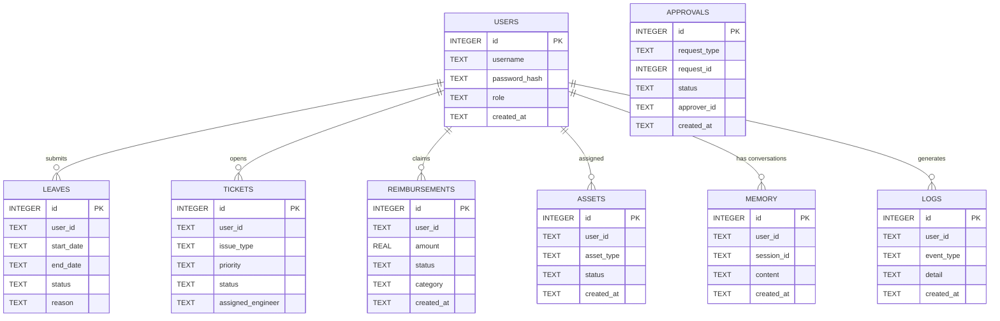

# Database Visualization: `app.db`

The database located at `data/app.db` is an **SQLite** database used by your Swarm AI project. Here is a comprehensive breakdown of its structure, relationships, and current data.

## Entity-Relationship (ER) Diagram

Below is a visual representation of how the tables in your database are structured and how they relate to each other:

## Table Breakdown

Here is what each table is responsible for:

1. **`users`**: Stores the credentials and roles for the new Enterprise RBAC auth system.
   - *Columns*: `id`, `username`, `password_hash`, `role`, `created_at`
2. **`leaves`**: HR-related table for tracking employee time-off requests.
   - *Columns*: `id`, `user_id`, `start_date`, `end_date`, `status`, `reason`
3. **`tickets`**: IT-related table for support requests.
   - *Columns*: `id`, `user_id`, `issue_type`, `priority`, `status`, `assigned_engineer`
4. **`reimbursements`**: Finance-related table for tracking employee expenses.
   - *Columns*: `id`, `user_id`, `amount`, `status`, `category`, `created_at`
5. **`assets`**: Tracks hardware or software assets assigned to users.
6. **`memory`**: Stores the chat history and context for the AI Copilot sessions.
7. **`approvals`**: Generic table for managing approval workflows (e.g., manager approving a leave or reimbursement).
8. **`logs`**: Tracks system events and audit trails.

## Sample Data

I queried your database to see what's currently inside. Here are a few examples:

**`users` table:**
| id | username | password_hash | role | created_at |
|----|----------|---------------|------|------------|
| 1 | testuser | `$2b$12$...` | employee | 2026-05-05T... |

**`memory` table (AI Chat History):**
| id | user_id | session_id | content | created_at |
|----|---------|------------|---------|------------|
| 1 | user-b5... | session-... | apply leave from 12/02... | 2026-05-04... |
| 2 | Pavan | session-... | What are the company p... | 2026-05-04... |

**`leaves` table:**
| id | user_id | start_date | end_date | status | reason |
|----|---------|------------|----------|--------|--------|
| 1 | user-b5... | 2026-05-11 | 2026-05-12 | pending | |

## How to View It Yourself

Since `app.db` is an SQLite database file, it is stored in binary format. You cannot read it directly in a text editor like VS Code without a special tool.

**Recommended Tools:**
1. **VS Code Extension (Easiest)**: Install the **"SQLite Viewer"** or **"SQLTools"** extension in VS Code. Once installed, simply click on `app.db` in your file explorer, and it will open in a nice grid view.
2. **DB Browser for SQLite**: You can download this free desktop application. Open the app, click "Open Database," and select your `app.db` file to browse data and run SQL queries visually.
